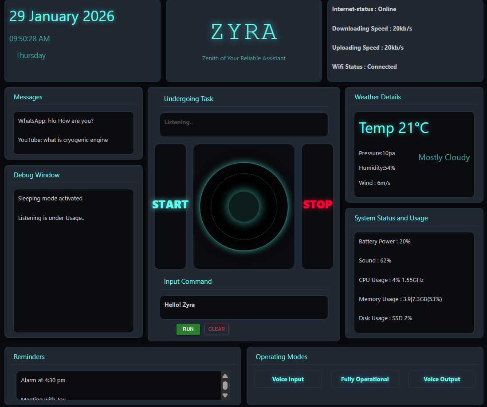
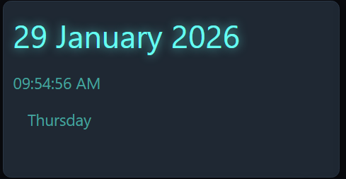
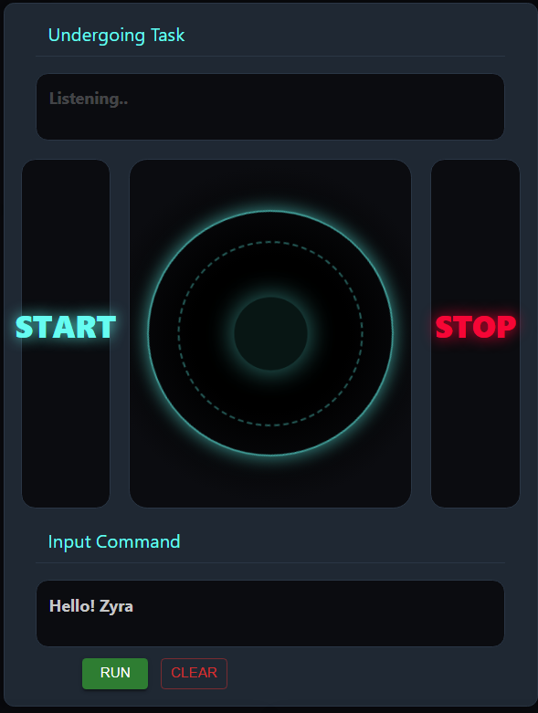
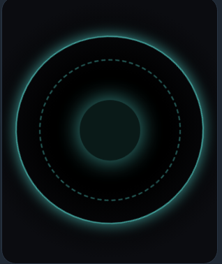
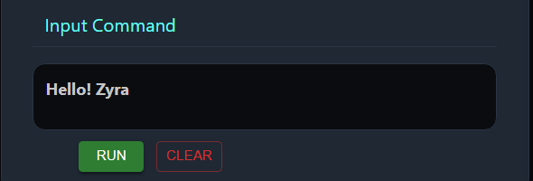
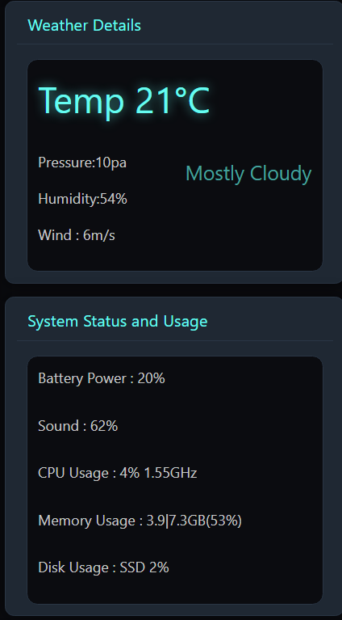
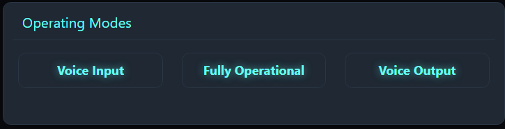

# Case Study | Zyra AI Dashboard UI using React, Bootstrap & Material UI

## Project Name  
**Zyra AI – Interactive Dashboard UI (Case Study)**

---

## 📌 Project Overview
This case study focuses on designing and implementing a **futuristic AI assistant dashboard UI (Zyra AI)** using React.  
The interface displays real-time system information, task status, visualizer animations, reminders, weather details, and operating modes in a clean, responsive layout.

The project demonstrates **hybrid usage of React-Bootstrap for layout** and **Material UI for component design**, combined with custom CSS for a neon cyber-themed UI.

---

## 🛠️ Technologies / Tools Used
- React JS  
- Vite  
- React-Bootstrap  
- Bootstrap 5  
- Material UI (MUI)  
- HTML5  
- CSS3 (Custom Styling & Animations)  
- JavaScript (Hooks & State Management)  

---

## 📂 Case Study Modules / Sections

---

### Module 1 – Layout Structure (Bootstrap Container)

**What I used:**
- React-Bootstrap `Container (fluid)`
- Bootstrap utility classes (`p-0`, `m-0`)
- Flexbox-based layout system

**Purpose:**
- Overall responsive layout for the dashboard

📸 **Output Screenshot:**  

---

### Module 2 – Information Panels using Material UI (Paper)

**What I used:**
- MUI `Paper` component
- Custom CSS overrides for dark neon theme

**Sections Included:**
- Date & Time Panel  
- Network Status Panel  
- Messages Panel  
- Debug Window  

📸 **Output Screenshot:**  

---

### Module 3 – Undergoing Task & Listening Indicator

**What I used:**
- React `useState` and `useEffect`
- Blinking animation using state toggling

**Purpose:**
- Visual feedback for assistant listening state

📸 **Output Screenshot:**  

---

### Module 4 – Audio Visualizer (CSS Animation)

**What I used:**
- Pure CSS animations
- Rotating rings & pulse effect
- Custom visualizer container

**Purpose:**
- Simulated AI activity visualization

📸 **Output Screenshot:**  

---

### Module 5 – Input Command & Action Buttons

**What I used:**
- MUI `Button` component
- Custom styled input panel

**Actions:**
- Run command
- Clear input

📸 **Output Screenshot:**  

---

### Module 6 – Weather & System Status Panels

**What I used:**
- MUI `Paper`
- Structured data display using flexbox

**Details Shown:**
- Temperature & Weather State  
- CPU, Memory, Battery, Disk Usage  

📸 **Output Screenshot:**  

---

### Module 7 – Reminders & Operating Modes

**What I used:**
- Scrollable reminder panel
- Custom buttons for operating modes

**Modes Included:**
- Voice Input  
- Fully Operational  
- Voice Output  

📸 **Output Screenshot:**  

---

## 🎯 Learning Outcomes
- Learned hybrid usage of **React-Bootstrap and Material UI**
- Improved understanding of **React hooks (`useState`, `useEffect`)**
- Designed complex dashboard layouts using **flexbox**
- Implemented **CSS animations for UI feedback**
- Built a scalable UI foundation for an AI assistant system

---

## 🚀 Conclusion
This case study demonstrates how modern React applications can effectively combine multiple UI libraries while maintaining performance, readability, and design consistency.  
The Zyra AI dashboard serves as a strong base UI for future AI assistant integrations such as voice input, real-time data, and automation features.

---

