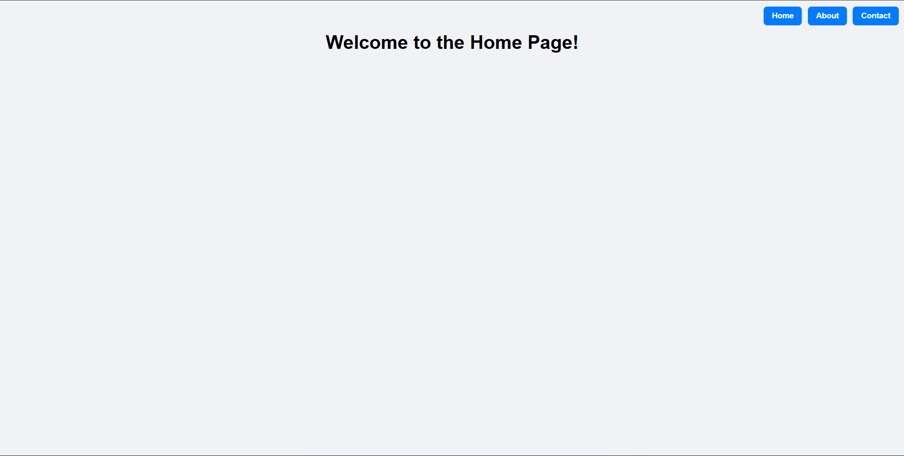
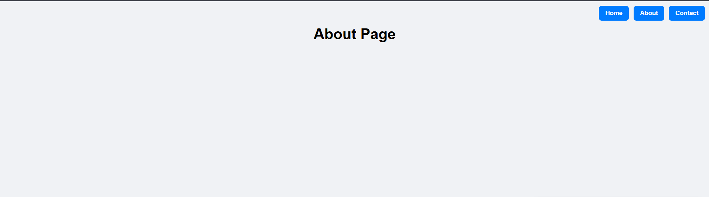
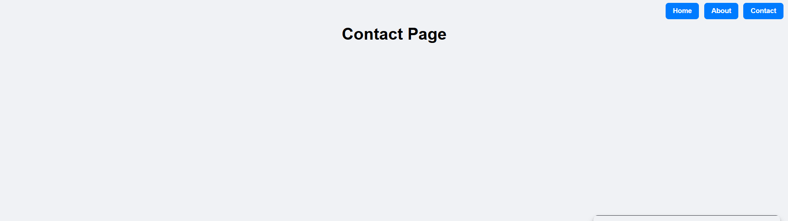
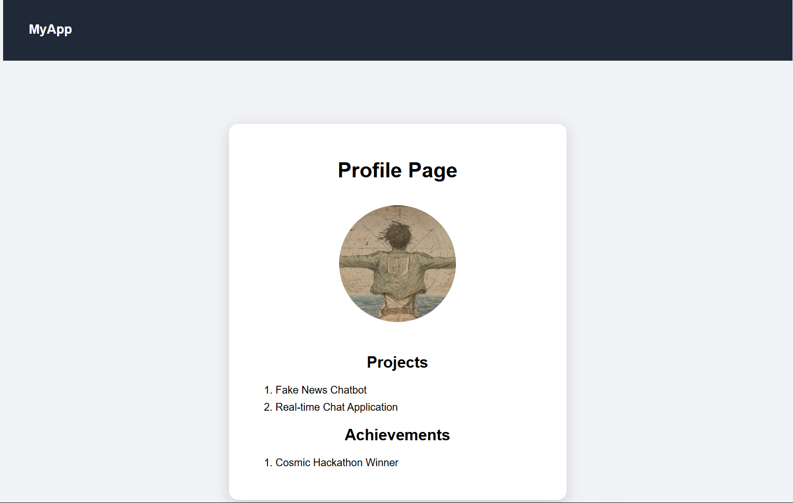
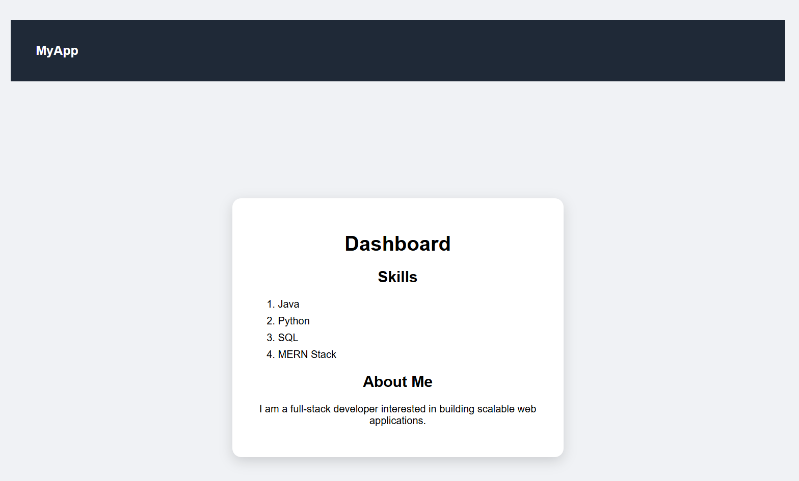
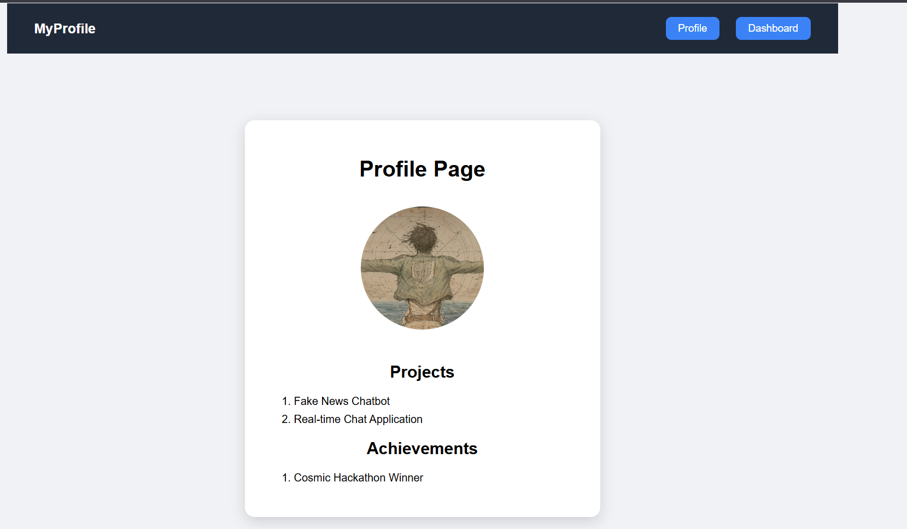
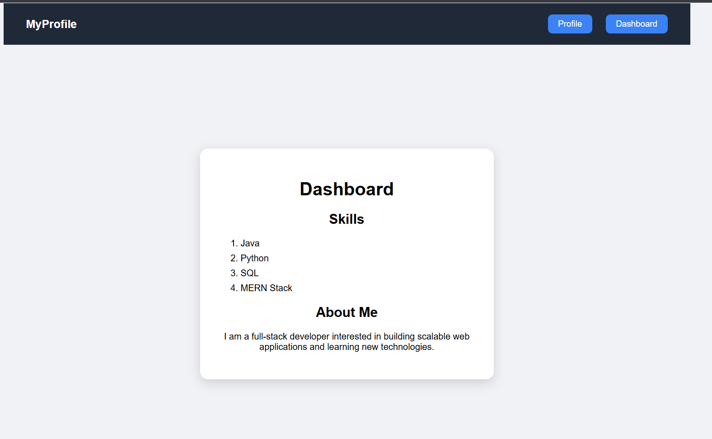

# React Router SPA – Working Explanation

This project demonstrates how **React Router DOM** is used to build a **Single Page Application (SPA)** with multiple pages and smooth navigation **without page reloads**.

The application includes **two versions of Profile and Dashboard pages**:
1. Without navigation buttons (basic routing)
2. With navigation buttons (Link-based navigation)

---

## 🔹 How Routing Works in This Application

- The entire app is wrapped inside `BrowserRouter`
- Each page is mapped to a route using `Route`
- Navigation is handled using `Link` components
- Only components change — the page never reloads

---

## 🖼️ Screenshots & Page Flow Explanation

---

## 1️⃣ Home Page

- Default landing page
- Displays navigation buttons (Home, About, Contact)
- Clicking buttons changes the route

---

## 2️⃣ About Page

- Loaded when `/about` route is accessed
- Displays static information
- Page switches without reload

---

## 3️⃣ Contact Page

- Loaded when `/contact` route is accessed
- Confirms smooth client-side navigation

---

## 4️⃣ Profile Page (Without Buttons)

- Basic Profile page
- Contains:
  - Profile image
  - Projects list
  - Achievements
- No navigation buttons inside the page
- Demonstrates **basic routing using Route**

---

## 5️⃣ Dashboard Page (Without Buttons)

- Displays skills and about-me section
- No internal navigation buttons
- Demonstrates multi-page SPA behavior

---

## 6️⃣ Profile Page (With Navigation Buttons)

- Enhanced Profile page
- Includes **Profile** and **Dashboard** buttons
- Buttons are implemented using `Link`
- Allows navigation without page reload

---

## 7️⃣ Dashboard Page (With Navigation Buttons)

- Enhanced Dashboard page
- Navigation buttons allow switching between pages
- Confirms **Link-based navigation**

---

## ⚙️ Behind the Scenes

- `BrowserRouter` controls routing
- `Routes` defines route mapping
- `Route` renders components based on URL
- `Link` enables button-based navigation
- SPA behavior is maintained throughout

---

## ✅ Final Result

- Both basic and advanced routing are successfully implemented
- Navigation works smoothly
- No browser refresh occurs
- All experiments are verified using screenshots

---
